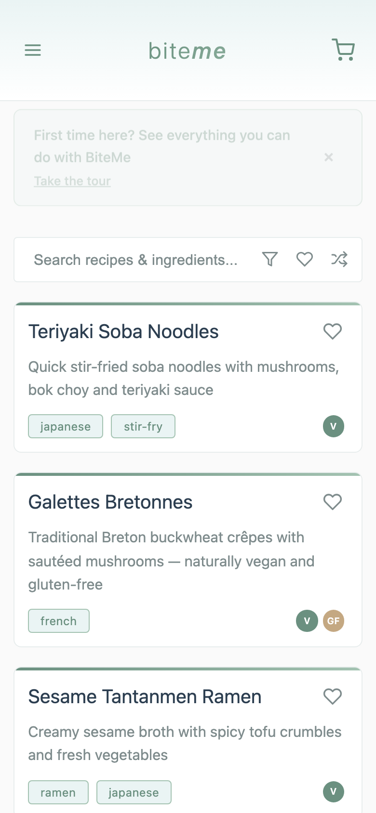
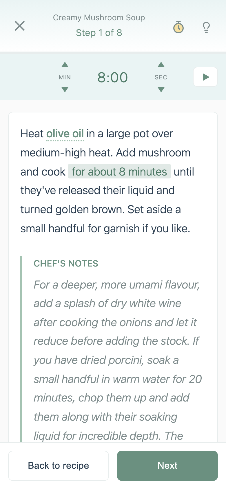
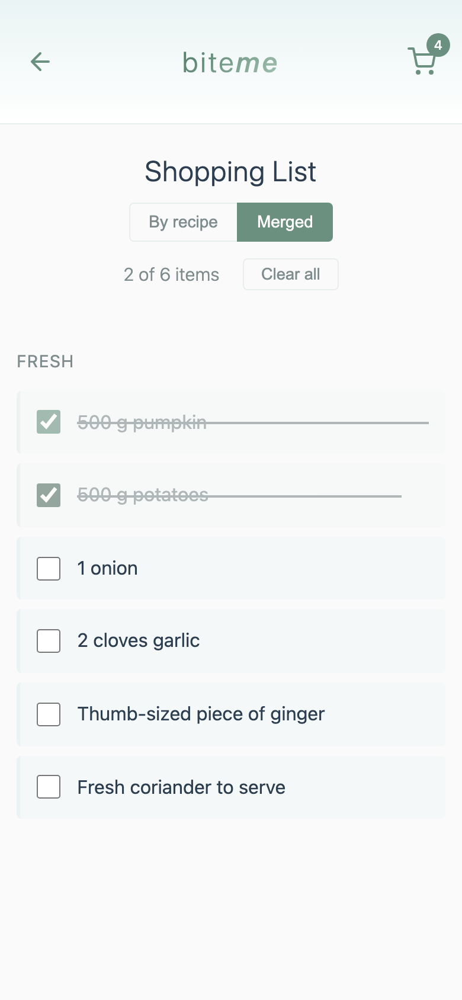

# biteme 🌱

A simple, open-source vegetarian/vegan recipe app with an elegant minimalist design.

## Live Demo

**https://jameslafa.github.io/biteme/**

## What It Looks Like

<table>
  <tr>
    <td align="center"></td>
    <td align="center"></td>
  </tr>
  <tr>
    <td align="center"><b>Browse & discover</b><br><sub>Search recipes, save your favourites, find what to cook tonight</sub></td>
    <td align="center"><b>Plan your cook</b><br><sub>Clear ingredient list — check off what you have, add the rest to your shopping list</sub></td>
  </tr>
  <tr>
    <td align="center"></td>
    <td align="center"></td>
  </tr>
  <tr>
    <td align="center"><b>Hands-free cooking</b><br><sub>Step-by-step mode with screen wake lock — designed for messy hands and busy kitchens</sub></td>
    <td align="center"><b>Shop smart</b><br><sub>All your missing ingredients in one place — check them off as you walk the aisles</sub></td>
  </tr>
</table>

## Why BiteMe?

- 🌱 **Plant-based focus** — Curated vegetarian and vegan recipes
- 🔒 **Privacy-first** — No accounts, no tracking, everything stored on your device
- 📴 **Works offline** — Install it as an app, use it anywhere without internet
- 🤝 **Community-driven** — Anyone can contribute recipes via pull request
- 🆓 **Free forever** — No ads, no paywalls, no premium tiers

## Why I Built This

I haven't found a cooking app I truly enjoyed using. Most are cluttered with ads, tracking, paywalls, or endless content you don't need. I wanted something different—a community-driven, open-source recipe app that's private, safe, and focused on what matters: cooking great food.

Simple features like checking off ingredients, building a shopping list, and having a distraction-free focus mode while cooking make all the difference. BiteMe is built for people who want a clean, functional tool without the noise.

**Want to contribute?** Share your favorite recipes by opening a pull request. Help make this the recipe app we all wish existed.

## Technology Stack

- Vanilla JavaScript (no frameworks)
- HTML5/CSS3 with CSS custom properties
- IndexedDB for local data storage
- Mobile-first responsive design
- GitHub Pages hosting

## Local Development

1. Clone the repository:
   ```bash
   git clone https://github.com/jameslafa/biteme.git
   cd biteme
   ```

2. Install dependencies:
   ```bash
   npm install
   npx playwright install chromium
   ```

3. Start the development server:
   ```bash
   npm run dev
   ```

4. Open your browser to `http://localhost:8080`

## Testing

E2E regression tests are built with [Playwright](https://playwright.dev/):

```bash
npm run test:all                  # Run all tests (parser + Playwright)
npm test                          # Run Playwright tests only
npm run test-parser               # Run parser tests only
npx playwright test --ui          # Visual test runner
npx playwright test tests/home    # Run a specific file
```

A pre-push git hook automatically runs tests before every `git push`.

## Contributing

Contributions are welcome! Please see our [Contributing Guide](CONTRIBUTING.md) for details on:
- Adding new recipes
- Recipe format and guidelines
- Code contributions

See our [Roadmap](documentation/ROADMAP.md) for planned features and ideas.

### Quick Start for Contributors

1. Fork the repository
2. Create a feature branch (`git checkout -b feature/amazing-feature`)
3. Commit your changes (`git commit -m 'Add amazing feature'`)
4. Push to the branch (`git push origin feature/amazing-feature`)
5. Open a Pull Request

## License

This project is licensed under the MIT License - see the [LICENSE](LICENSE) file for details.

## Documentation

- [Contributing Guide](CONTRIBUTING.md) - How to add recipes and contribute
- [Roadmap](documentation/ROADMAP.md) - Planned features and ideas
- [Architecture](documentation/ARCHITECTURE.md) - Technical decisions
- [Data Structure](documentation/DATA_STRUCTURE.md) - Database schemas

## Acknowledgments

- Illustrations by [unDraw](https://undraw.co/)
- Built with love for plant-based cooking! 🌱
